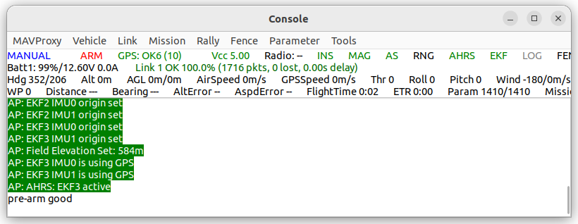
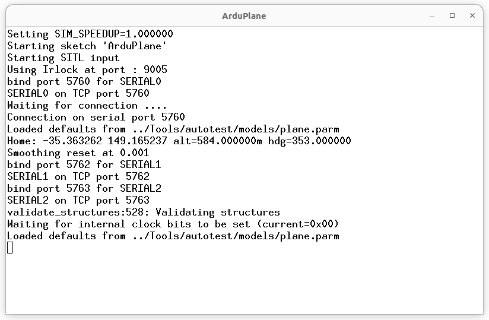
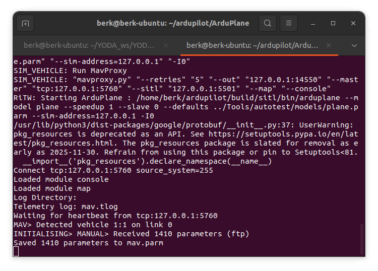

# ArduPilot SITL Kurulumu ve Simülasyon Başlatma

- Sorumlu: @WorldOFBerk
- Tarih: 24-10-2025
- Konu: ArduPilot SITL kurulumu, sim_vehicle.py ile uçuş simülasyonu

-----------------------------------------------------

#### AMAÇ
Bu belge ArduPilot yazılımının yerel geliştirme ortamına kurulması, SITL simülasyonunun başlatılması
ve bağlantı portlarının doğrulanması için hazırlanmıştır.

-----------------------------------------------------

### ARDUPILOT KURULUM ADIMLARI

1. Repository klonlama:
```
git clone https://github.com/ArduPilot/ardupilot.git
cd`ardupilot
```

2. Submodule güncelleme:
```
git submodule update --init --recursive
```
3. Gerekli bağımlılıkların kurulumu:
```
sudo apt install python3-pip python3-dev python3-setuptools python3-wheel -y
sudo apt install git libtool libxml2-dev libxslt1-dev pkg-config -y
sudo apt install g++ gcc make build-essential -y
```

4. Ek simülasyon bağımlılıkları:
```
sudo apt install libudev-dev python3-future python3-matplotlib python3-lxml -y
```

5. PATH tanımlaması:
```
echo "export PATH=$PATH:$HOME/ardupilot/Tools/autotest" >> ~/.bashrc
source ~/.bashrc
```
-----------------------------------------------------

#### SİMÜLASYON BAŞLATMA (SITL)

Uçak (ArduPlane):
```
cd ~/ardupilot/ArduPlane
sim_vehicle.py -w
sim_vehicle.py --console --map
```
Multikopter (Copter):
```
cd ~/ardupilot/ArduCopter
sim_vehicle.py --console --map
```
Helikopter:
```
cd ~/ardupilot/ArduHeli
sim_vehicle.py --console --map
```
-----------------------------------------------------

#### SİSTEM ÇIKIŞLARI

Açılan pencereler:
- MAVProxy console → telemetri mesaj akışı
- Map arayüzü → konum ve rota gösterimi

Beklenen mesaj örnekleri:
- GPS lock simulation
- EKF alt-state initialization
- ARMING check notifications

  
*Şekil 1. MAVProxy Console telemetri akışı.*

  
*Şekil 2. ArduPlane başlatma ekranı.*

  
*Şekil 3. Harita arayüzü ve uçak konumu.*

  
*Şekil 4. MAVProxy parametre yükleme ve bağlantı mesajları.*


-----------------------------------------------------

#### BAĞLANTI PORTLARI

Varsayılan SITL portları:
- UDP 14550 → Ground Control (Mission Planner, QGC)
- UDP 14551 → Companion computer (ROS2, Unity köprüsü)
- TCP 5760  → MAVProxy / Terminal backend

Harici simülasyonlar için kullanılabilir port:
- UDP 14552 → Unity/Bridge veya test endpoint

-----------------------------------------------------

ORNEK BAŞLATMA KOMUTU (GRAFİK HARİTA + KONSOL)
```
sim_vehicle.py --map --console
```
Bu komut çalıştırıldığında:
- uçuş dünyası başlatılır
- 3D harita simülasyonu açılır
- telemetri akışı canlı takip edilir

-----------------------------------------------------

SITL TEST DOĞRULAMALARI

Test 1: ARM komutu
```
mode GUIDED
arm throttle
```

Test 2: kalkış
```
takeoff 50

Test 3: yönlendirme
rc 3 1500
```
Test sırasında GPS lock simülasyon delay beklenebilir.

-----------------------------------------------------

#### HATALAR VE ÇÖZÜMLER

Hata: "No module named pymavlink"
Çözüm: pip3 install pymavlink

Hata: "Xvfb display error"
Çözüm: headless mod kullanım -> sim_vehicle.py --no-map

Hata: port çakışması
Çözüm: yeni port ile başlat → sim_vehicle.py -I 2

-----------------------------------------------------

SONUÇ

- ArduPilot kaynak kodu başarıyla klonlandı
- SITL simülasyon ortamı çalıştırıldı
- UDP bağlantı portları doğrulandı
- Telemetri akışı test edildi ve harita arayüzü açıldı

-----------------------------------------------------

REFERANSLAR

- https://github.com/ArduPilot/ardupilot
- https://ardupilot.org/dev/docs/using-sitl-for-ardupilot-testing.html
